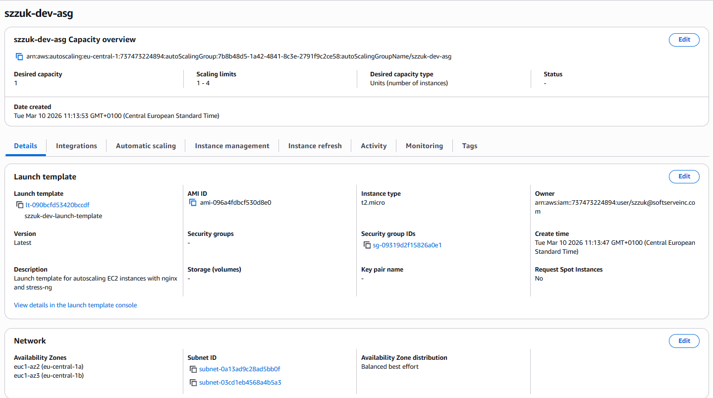
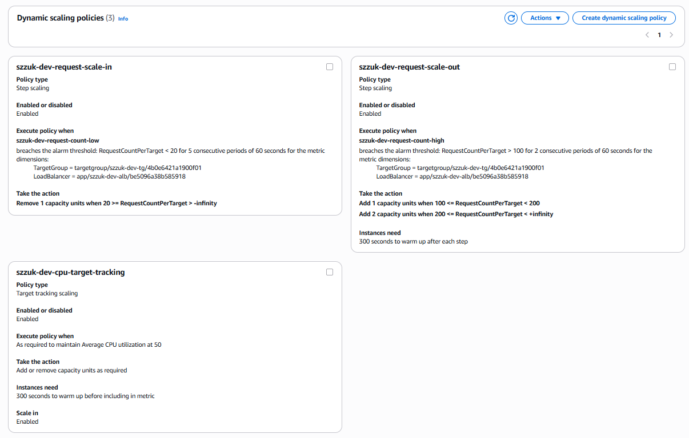
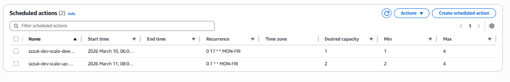
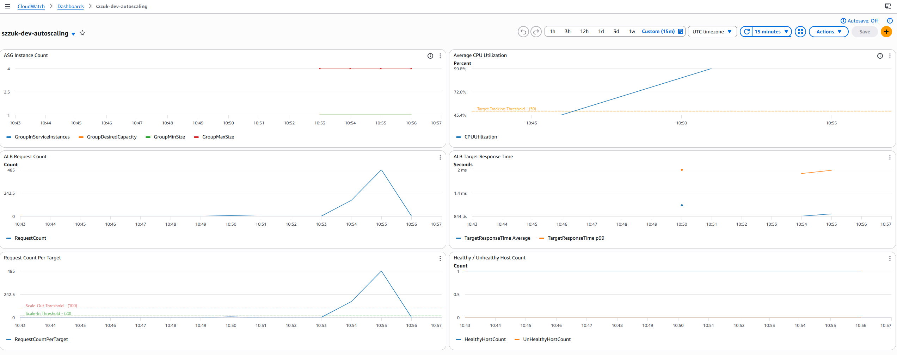
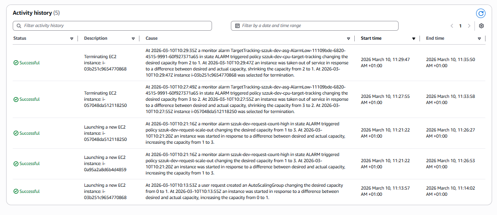

# EC2 Auto Scaling with Terraform

This project configures and manages automated scaling of EC2 virtual machines using AWS Auto Scaling Groups, dynamic scaling policies, scheduled scaling actions, and CloudWatch monitoring.

## Architecture

Internet traffic arrives on port 80 at an **Application Load Balancer (ALB)**, which forwards requests to a **Target Group** performing health checks on `/`. The target group distributes traffic across **EC2 instances** (running nginx and stress-ng) spread across two availability zones.

The instances are managed by an **Auto Scaling Group** (min 1, max 4) which adjusts capacity through three mechanisms:

- **Target Tracking Policy** -- maintains average CPU utilization at 50% (AWS-managed alarms)
- **Step Scaling Policy** -- scales based on ALB request count per target (manually configured CloudWatch alarms with multi-step adjustments)
- **Scheduled Scaling** -- increases minimum capacity to 2 during business hours (Mon-Fri 7:00-17:00 UTC)

All scaling events are published to an **SNS topic** and visualized on a **CloudWatch dashboard** with metrics for instance count, CPU utilization, request count, and response time.

## Prerequisites

- AWS CLI configured with profile `softserve-lab`
- Terraform >= 1.0 installed
- Existing VPC with an internet gateway in `eu-central-1` (subnets are created by this project)

## Quick Start

```bash
cd compute_autoscaling

# Initialize Terraform
terraform init

# Preview resources
terraform plan

# Deploy
terraform apply

# Get the ALB endpoint
terraform output alb_url
```

## Scaling Strategy

### Instance Limits

| Parameter | Value | Rationale |
|-----------|-------|-----------|
| `min_size` | 1 | Minimum single instance to keep costs low during off-hours |
| `max_size` | 4 | Cap to prevent runaway scaling and cost overruns |
| `desired_capacity` | 1 | Start with minimum; let scaling policies adjust as needed |
| `cooldown_period` | 300s | Prevent rapid successive scaling actions; allows metrics to stabilize |
| `health_check_grace_period` | 300s | Time for new instances to bootstrap before health checks begin |

### Dynamic Scaling Policies

Two dynamic scaling policies are attached to demonstrate different approaches:

#### Policy 1: Target Tracking (CPU Utilization)

- **Type**: `TargetTrackingScaling`
- **Metric**: `ASGAverageCPUUtilization`
- **Target**: 50%
- **Behavior**: AWS automatically creates and manages both scale-out and scale-in CloudWatch alarms. When average CPU exceeds 50%, instances are added; when it drops well below 50%, instances are removed.

#### Policy 2: Step Scaling (ALB Request Count Per Target)

- **Type**: `StepScaling`
- **Metric**: `RequestCountPerTarget` (requires manually created CloudWatch alarms)
- **Scale-out thresholds**:
  - Requests > 100/target → add 1 instance
  - Requests > 200/target → add 2 instances
- **Scale-in threshold**: Requests < 20/target → remove 1 instance
- **Evaluation**: Scale-out alarm triggers after 2 consecutive breach periods (2 min); scale-in after 5 periods (5 min) for conservative scale-in.

### Scheduled Scaling

| Action | Schedule (UTC) | Local (CET) | min_size | desired |
|--------|---------------|-------------|----------|---------|
| Business hours | `0 7 * * MON-FRI` | 8:00 AM | 2 | 2 |
| After hours | `0 17 * * MON-FRI` | 6:00 PM | 1 | 1 |

This ensures at least 2 instances are running during weekday business hours for predictable traffic, scaling back to 1 during evenings and weekends.

## Scaling Policy Types Comparison

| Feature | Target Tracking | Step Scaling | Simple Scaling |
|---------|----------------|--------------|----------------|
| **Alarm management** | Automatic (AWS-managed) | Manual (you create alarms) | Manual |
| **Granularity** | Single target value | Multiple steps with different adjustments | Single adjustment |
| **Scale-in** | Automatic (built-in) | Requires separate policy + alarm | Requires separate policy + alarm |
| **Cooldown** | Managed per scale-out/in | Configurable `cooldown` | Uses ASG `default_cooldown` |
| **Best for** | Steady-state targets (CPU, request count) | Variable response (gradual vs. aggressive) | Simple on/off scaling |
| **Complexity** | Low | Medium | Low |

**When to use each:**

- **Target Tracking**: Best default choice. Use when you want to maintain a specific metric at a target value (e.g., keep CPU at 50%). AWS handles all alarm creation and tuning.
- **Step Scaling**: Use when you need different scaling magnitudes for different severity levels (e.g., add 1 instance at moderate load, add 3 at extreme load). Requires explicit alarm setup.
- **Simple Scaling**: Legacy approach. Adds/removes a fixed number of instances when an alarm fires. Enforces a cooldown period where no other scaling can occur. Generally superseded by step scaling.

## Metric Thresholds

| Metric | Threshold | Direction | Policy Type | Evaluation |
|--------|-----------|-----------|-------------|------------|
| CPU Utilization | 50% | Target | Target Tracking | AWS-managed |
| Request Count / Target | > 100 | Scale-out | Step Scaling | 2 × 60s periods |
| Request Count / Target | > 200 | Aggressive scale-out | Step Scaling | 2 × 60s periods |
| Request Count / Target | < 20 | Scale-in | Step Scaling | 5 × 60s periods |

## Testing Guide

### Trigger Scale-Out

**HTTP load (triggers both CPU and request count policies)**

```bash
# Use the provided script
./scripts/generate-load.sh
```

## Proof of Completion

### Auto Scaling Group Configuration

ASG details showing min/max/desired capacity, health check type, launch template, and subnet placement across availability zones.



### Dynamic Scaling Policies

Target tracking (CPU 50%) and step scaling (request count) policies attached to the ASG with configured metric thresholds.



### Scheduled Scaling Actions

Business hours schedule: scale up to min 2 at 7:00 UTC on weekdays, scale down to min 1 at 17:00 UTC.



### CloudWatch Dashboard — Metrics and Scaling Events

Dashboard showing CPU utilization, instance count, ALB request count, and response time during load testing. Demonstrates both scale-out (instance count increase) and scale-in (instance count decrease) behavior.



### Scaling Activity History

Audit log of scaling events showing instance launches and terminations with timestamps and causes.



## Cleanup

```bash
terraform destroy
```

## Files

| File | Purpose |
|------|---------|
| `main.tf` | AWS provider configuration and terraform block |
| `variables.tf` | Input variables with defaults |
| `outputs.tf` | ALB DNS, ASG name, policy ARNs, CLI commands |
| `networking.tf` | Public subnets, route table, ALB and EC2 security groups |
| `launch_template.tf` | EC2 launch template with nginx + stress-ng user data |
| `alb.tf` | Application Load Balancer, target group, listener |
| `autoscaling.tf` | ASG, scaling policies (target tracking + step), scheduled actions |
| `monitoring.tf` | CloudWatch dashboard and SNS scaling notifications |
| `scripts/generate-load.sh` | HTTP traffic generator for scale-out testing |
| `scripts/check-scaling-status.sh` | ASG status, scaling activities, and alarm states |
