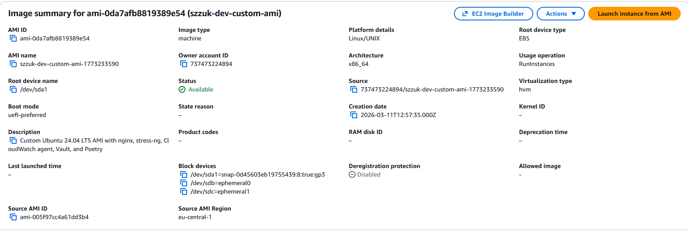

# Compute Custom AMI - Ubuntu 24.04 LTS with Packer

Custom machine image built with HashiCorp Packer on Ubuntu 24.04 LTS (Noble Numbat). Pre-bakes all project software, security hardening, and configuration into the AMI so instances launch ready to serve with zero boot-time provisioning.

## Architecture

| Component | Tool | Purpose |
|-----------|------|---------|
| Image builder | HashiCorp Packer (HCL2) | Builds AMI from Ubuntu 24.04 LTS base |
| Base OS | Ubuntu 24.04 LTS | Canonical official AMI (amd64, hvm-ssd-gp3) |
| AMI lookup | Terraform `data.aws_ami` | Query latest custom AMI by tags |
| Lifecycle | Shell scripts | Build and delete AMIs |

### Pre-installed Software

| Software | Version | Purpose |
|----------|---------|---------|
| nginx | latest (apt) | Web server |
| stress-ng | latest (apt) | Load testing and CPU stress |
| Amazon CloudWatch Agent | latest | Enhanced monitoring and log collection |
| AWS SSM Agent | latest (snap) | Systems Manager connectivity for remote access |
| HashiCorp Vault | latest (HashiCorp APT repo) | Secrets management client |
| Poetry | latest (official installer) | Python dependency management |
| Python 3.12 | system (Ubuntu 24.04) | Runtime for Poetry and applications |
| auditd | latest (apt) | Security audit logging |

### Security Hardening

- SSH: root login disabled, password auth disabled, max 3 auth tries
- Core dumps disabled
- Default umask set to 027
- Audit rules for identity files, sudoers, auth log, and command execution
- Unused services (avahi, cups, bluetooth) disabled
- Restrictive permissions on sensitive files

## Deployment

### Prerequisites

- [Packer](https://developer.hashicorp.com/packer/install) >= 1.9
- [Terraform](https://developer.hashicorp.com/terraform/install) >= 1.0
- AWS CLI configured with profile `softserve-lab`

### Build the AMI

```bash
# Using the helper script
./scripts/build-ami.sh

# Or manually
cd packer
packer init .
packer validate .
packer build .
```

The build creates an AMI named `szzuk-dev-custom-ami-<timestamp>` in `eu-central-1`.

### Delete all custom AMIs

```bash
./scripts/delete-ami.sh
```

Deregisters all custom AMIs matching the project tags and deletes their associated EBS snapshots.

### Query the AMI with Terraform

```bash
terraform init
terraform plan    # shows the latest custom AMI
terraform apply   # outputs AMI ID, name, and creation date
```

Other projects can reference the AMI using the same `data.aws_ami` filter:

```hcl
data "aws_ami" "custom" {
  most_recent = true
  owners      = ["self"]

  filter {
    name   = "tag:Project"
    values = ["compute-custom-ami"]
  }
  filter {
    name   = "tag:Environment"
    values = ["dev"]
  }
}
```

## Configuration

### Packer Variables (`packer/variables.pkr.hcl`)

| Variable | Default | Description |
|----------|---------|-------------|
| `aws_profile` | `softserve-lab` | AWS CLI profile |
| `aws_region` | `eu-central-1` | Build region |
| `project_name` | `szzuk` | Resource naming prefix |
| `environment` | `dev` | Environment suffix |
| `instance_type` | `t2.micro` | Build instance type |
| `ami_description` | (see file) | AMI description |

### Terraform Variables (`variables.tf`)

| Variable | Default | Description |
|----------|---------|-------------|
| `project_name` | `szzuk` | Resource naming prefix |
| `environment` | `dev` | Environment for AMI tag filter |

## Updating the Image

To reconfigure the AMI (add packages, change settings):

1. Edit the relevant provisioner script in `packer/scripts/`
2. Run `./scripts/delete-ami.sh` to remove old AMIs
3. Run `./scripts/build-ami.sh` to build a new version
4. Update any infrastructure using the AMI (e.g., trigger ASG instance refresh)

### Adding a new package

Edit `packer/scripts/install-packages.sh` and add the package to the `apt-get install` command or add a new installation section.

### Changing security settings

Edit `packer/scripts/security-hardening.sh` to modify SSH config, audit rules, or service management.

### Changing the nginx default page

Edit `packer/scripts/configure-nginx.sh` to modify the HTML served at `/`.

## Project Structure

```
compute_custom_ami/
├── packer/
│   ├── custom-ami.pkr.hcl          # Packer template (source + build blocks)
│   ├── variables.pkr.hcl           # Packer input variables
│   └── scripts/
│       ├── install-packages.sh     # nginx, stress-ng, CloudWatch agent, Vault, Poetry
│       ├── configure-nginx.sh      # nginx config + default page
│       ├── security-hardening.sh   # SSH hardening, firewall, audit
│       └── cleanup.sh             # Remove temp files, reduce AMI size
├── scripts/
│   ├── build-ami.sh               # Build the AMI (wraps packer build)
│   └── delete-ami.sh             # Delete all custom AMIs and snapshots
├── main.tf                        # Provider config + AMI data source
├── variables.tf                   # Shared variables
├── outputs.tf                     # AMI ID, name, creation date outputs
└── README.md
```

## Proof of Completion

### Custom AMI in AWS Console



## Cleanup

```bash
./scripts/delete-ami.sh
```
