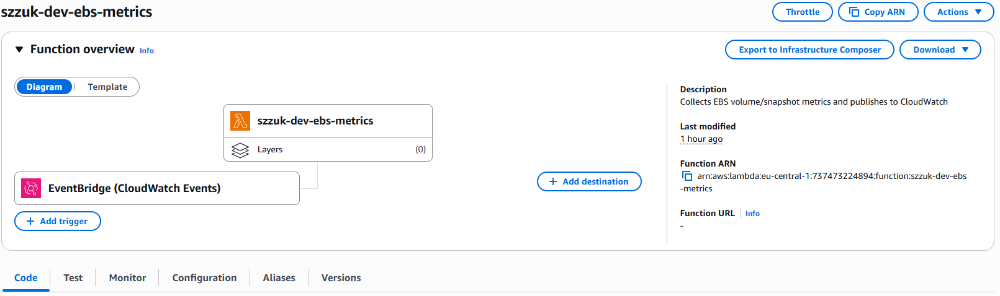
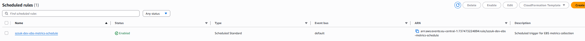
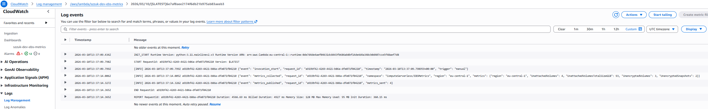
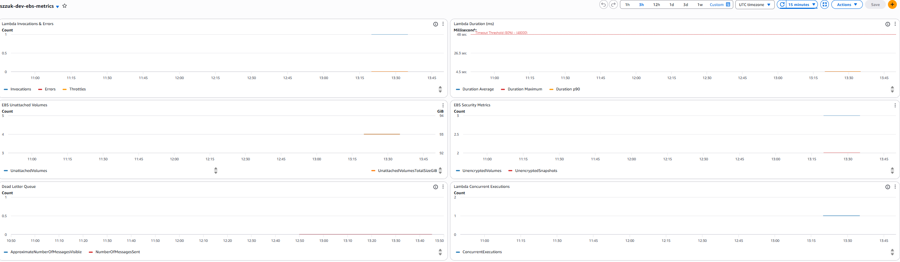
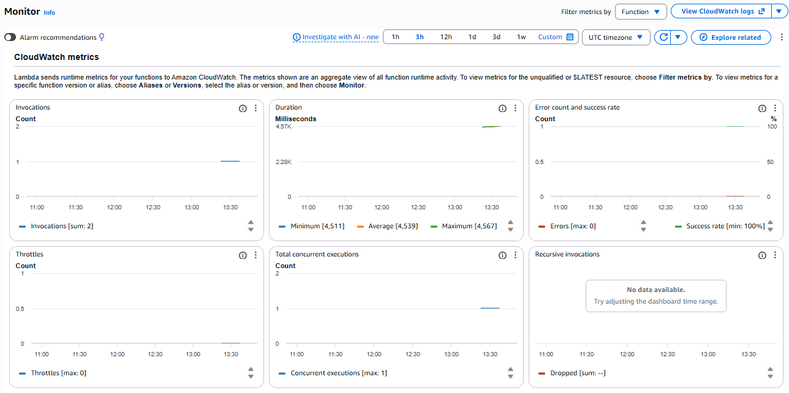

# Compute Serverless - EBS Metrics Collection with AWS Lambda

Serverless infrastructure that automatically collects EBS volume and snapshot metrics and publishes them to CloudWatch on a daily schedule. Demonstrates end-to-end serverless application deployment with scheduling, monitoring, error handling, and least-privilege IAM.

## Architecture

| Component | Service | Purpose |
|-----------|---------|---------|
| Function | AWS Lambda (Python 3.11) | Collects EBS metrics and publishes to CloudWatch |
| Trigger | Amazon EventBridge | Cron schedule (daily at 09:00 UTC) |
| Metrics | CloudWatch Custom Metrics | Namespace `ComputeServerless/EBSMetrics` |
| Logging | CloudWatch Logs | Structured JSON logs with 14-day retention |
| Monitoring | CloudWatch Dashboard + Alarms | Invocations, errors, duration, custom EBS metrics |
| Alerts | SNS Topic | Notifications for Lambda errors, duration, and DLQ |
| Error Handling | SQS Dead Letter Queue | Captures failed async invocations |

### Collected Metrics

| Metric | Unit | Description |
|--------|------|-------------|
| `UnattachedVolumes` | Count | Number of EBS volumes not attached to instances |
| `UnattachedVolumesTotalSizeGiB` | GiB | Total size of unattached EBS volumes |
| `UnencryptedVolumes` | Count | Number of unencrypted EBS volumes |
| `UnencryptedSnapshots` | Count | Number of unencrypted EBS snapshots |

### IAM Permissions (Least Privilege)

| Permission | Scope | Purpose |
|------------|-------|---------|
| `ec2:DescribeVolumes`, `ec2:DescribeSnapshots`, `ec2:DescribeVolumeStatus` | `*` (required by API) | Read EBS volume and snapshot metadata |
| `cloudwatch:PutMetricData` | Restricted to namespace | Publish custom metrics only to designated namespace |
| `logs:CreateLogStream`, `logs:PutLogEvents` | Specific log group ARN | Write logs to function's log group only |
| `sqs:SendMessage` | Specific DLQ ARN | Send failed invocations to dead-letter queue |


## Deployment

```bash
terraform init
terraform plan
terraform apply
```

## Configuration

All configuration is managed via `variables.tf`:

| Variable | Default | Description |
|----------|---------|-------------|
| `project_name` | `szzuk` | Resource naming prefix |
| `environment` | `dev` | Environment suffix |
| `lambda_memory_mb` | `128` | Lambda memory allocation (MB) |
| `lambda_timeout_s` | `60` | Lambda timeout (seconds) |
| `log_retention_days` | `14` | CloudWatch log retention |
| `cron_expression` | `cron(0 9 * * ? *)` | EventBridge schedule (daily 09:00 UTC) |
| `metric_namespace` | `ComputeServerless/EBSMetrics` | CloudWatch metrics namespace |

## Testing

### Manual Invocation

```bash
# Using the helper script
./scripts/invoke-function.sh

# Or invoke directly via AWS CLI
aws lambda invoke \
  --function-name szzuk-dev-ebs-metrics \
  --profile softserve-lab \
  --region eu-central-1 \
  --cli-binary-format raw-in-base64-out \
  --payload '{}' \
  /dev/stdout
```

Expected response:

```json
{
  "statusCode": 200,
  "body": "{\"message\":\"EBS metrics collected and published successfully\",\"region\":\"eu-central-1\",\"namespace\":\"ComputeServerless/EBSMetrics\",\"metrics\":{...},\"metrics_sent\":4}"
}
```

### Check Status

```bash
# Full status check (function config, schedule, alarms, metrics, DLQ)
./scripts/check-status.sh
```

### View Logs

```bash
aws logs tail /aws/lambda/szzuk-dev-ebs-metrics \
  --follow \
  --profile softserve-lab \
  --region eu-central-1
```

### View Custom Metrics

```bash
aws cloudwatch list-metrics \
  --namespace "ComputeServerless/EBSMetrics" \
  --profile softserve-lab \
  --region eu-central-1
```

### Monitor Alarms

```bash
aws cloudwatch describe-alarms \
  --alarm-name-prefix "szzuk-dev-ebs-metrics" \
  --profile softserve-lab \
  --region eu-central-1 \
  --query 'MetricAlarms[*].[AlarmName,StateValue]' \
  --output table
```

### Check Dead Letter Queue

```bash
aws sqs get-queue-attributes \
  --queue-url $(terraform output -raw dlq_url) \
  --attribute-names ApproximateNumberOfMessages \
  --profile softserve-lab \
  --region eu-central-1
```

## Project Structure

```
compute_serverless/
├── lambda/
│   └── src/
│       └── handler.py          # Lambda function code (Python 3.11)
├── scripts/
│   ├── invoke-function.sh      # Manual Lambda invocation
│   └── check-status.sh         # Status check (config, alarms, metrics, DLQ)
├── main.tf                     # Provider configuration
├── variables.tf                # Input variables
├── outputs.tf                  # Output values
├── lambda.tf                   # Lambda function, log group, DLQ
├── iam.tf                      # IAM role and least-privilege policies
├── eventbridge.tf              # EventBridge schedule rule and trigger
├── monitoring.tf               # CloudWatch dashboard, alarms, SNS topic
└── README.md
```

## Cleanup

```bash
terraform destroy
```

Verify all resources are removed:

```bash
aws resourcegroupstaggingapi get-resources \
  --tag-filters Key=Project,Values=compute-serverless \
  --profile softserve-lab \
  --region eu-central-1
```

## Proof of Completion

### Lambda Function Overview



### EventBridge Schedule Rule



### CloudWatch Logs



### CloudWatch Dashboard



### Lambda Monitoring


