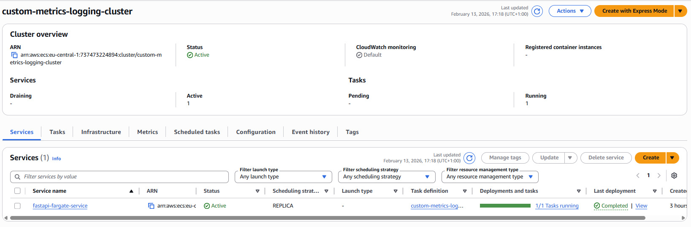
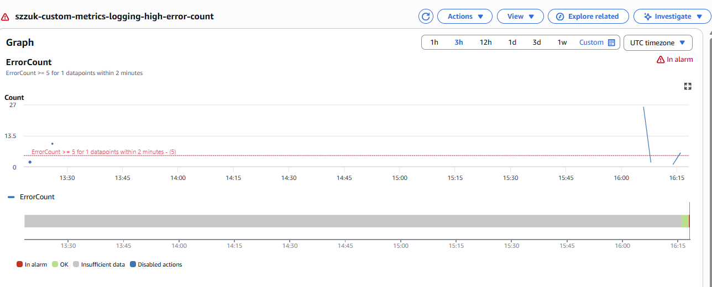

# Custom Metrics for Monitoring and Logging

Implementation of custom application metrics for a FastAPI service deployed on **AWS ECS Fargate**, using **Embedded Metric Format (EMF)** for CloudWatch integration. Infrastructure is managed with **Terraform**.

## Custom Metrics Defined

Five custom metrics are published under namespace **`CustomMetricsLogging/App`** with dimensions `Service` and `Endpoint`:

| Metric                  | Type    | Unit         | Purpose                                              |
| ----------------------- | ------- | ------------ | ---------------------------------------------------- |
| **RequestCount**        | Counter | Count        | Total HTTP requests; correlates with traffic volume. |
| **RequestLatencyMs**    | Gauge   | Milliseconds | Per-request response time (Average/p99).             |
| **ErrorCount**          | Counter | Count        | Responses with status >= 400; drives alerting.       |
| **ActiveRequests**      | Gauge   | Count        | In-flight requests; indicates concurrency.           |
| **EndpointInvocations** | Counter | Count        | Per-route call counts (`/`, `/Welcome`, `/error`).   |

Full definitions, expected ranges, and anomaly interpretation: [docs/custom_metrics.md](docs/custom_metrics.md).

## Implementation Approach

- **Instrumentation**: A FastAPI middleware (`EMFMetricsMiddleware`) captures path, status code, latency, and active-request count per request, then flushes an EMF JSON payload to **stdout**.
- **Collection**: ECS `awslogs` driver forwards stdout to CloudWatch Logs (`/ecs/custom-metrics-logging`). CloudWatch automatically extracts EMF metrics -- no CloudWatch Agent or `PutMetricData` needed.
- **Dashboard**: Terraform-managed CloudWatch dashboard with widgets for all five metrics, broken down by endpoint.
- **Alerting**: CloudWatch alarm triggers when `ErrorCount` sum >= 5 over 2 minutes.

## Project Structure

```
custom_metrics_logging/
├── fastapi-docker-optimized/
│   ├── server.py             # FastAPI app with EMF middleware
│   └── Dockerfile
├── docs/custom_metrics.md    # Metric definitions and interpretation
├── scripts/generate_traffic.sh
├── static/                   # Result screenshots
├── main.tf                   # Terraform provider
├── variables.tf              # Input variables
├── networking.tf             # Security group
├── ecr.tf                    # ECR repository
├── ecs.tf                    # ECS cluster, task, service
├── monitoring.tf             # Dashboard and alarms
└── outputs.tf
```

## Deployment

Prerequisites: AWS CLI (profile `softserve-lab`), Terraform, Docker.

```bash
# 1. Provision infrastructure
cd custom_metrics_logging
terraform init && terraform apply

# 2. Build and push image to ECR
ECR_URI=$(terraform output -raw ecr_repository_url)
aws ecr get-login-password --region eu-central-1 | docker login --username AWS --password-stdin $ECR_URI
docker build -t $ECR_URI:latest -f Dockerfile fastapi-docker-optimized
docker push $ECR_URI:latest

# 3. Force ECS to pull the new image
aws ecs update-service --cluster custom-metrics-logging-cluster \
  --service fastapi-fargate-service --force-new-deployment
```

## Testing

Get the task public IP from ECS console, then generate traffic:

```bash
./scripts/generate_traffic.sh http://<public-ip>
```

Verify:

1. **Logs**: CloudWatch Logs > `/ecs/custom-metrics-logging` -- EMF JSON lines with `_aws` section.
2. **Metrics**: CloudWatch Metrics > namespace `CustomMetricsLogging/App` -- all five metrics present.
3. **Dashboard**: CloudWatch Dashboards > **szzuk-custom-metrics-logging-dashboard** -- widgets show time-series data.
4. **Alarm**: Send 5+ requests to `/error` within 2 minutes -- alarm moves to ALARM state.

## Results

### ECS Service



### CloudWatch Dashboard


### CloudWatch Alarm



## Cleanup

```bash
terraform destroy
```
