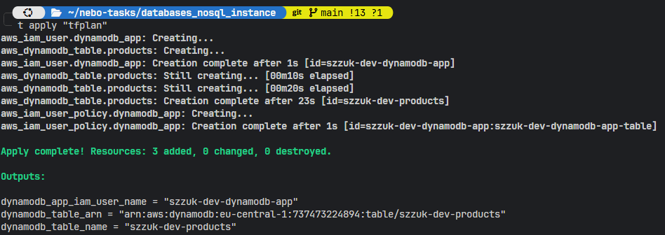
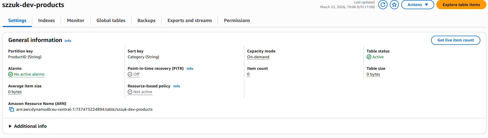
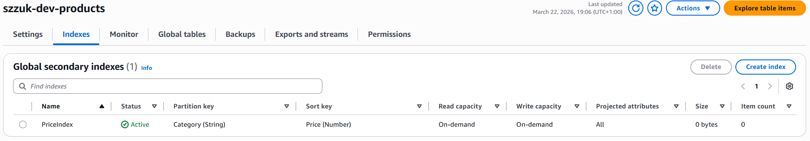
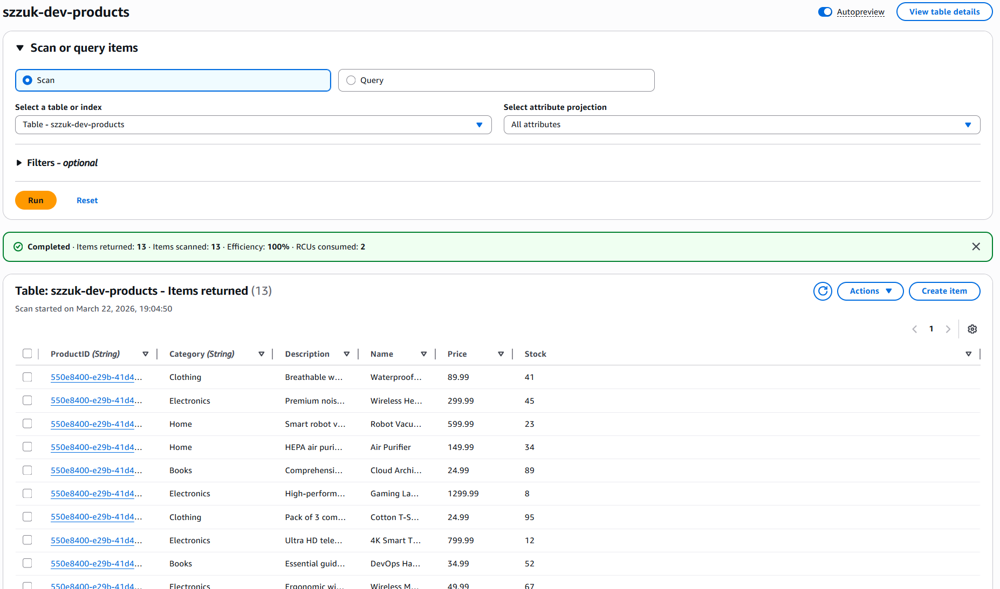

# DynamoDB NoSQL (AWS)

Terraform lab in **eu-central-1** with AWS profile **softserve-lab**: one **DynamoDB** table (`ProductID` + `Category` keys, on-demand billing), GSI **PriceIndex** (`Category` + `Price`), and an **IAM user** whose policy is limited to that table and its indexes. Shell scripts cover load, CRUD, queries, and cleanup.

## Deploy

```bash
cd databases_nosql_instance
terraform init && terraform apply
terraform output
```

## Scripts

| Script | Purpose |
|--------|---------|
| [`scripts/load-sample-data.sh`](scripts/load-sample-data.sh) | Batch-write [`data/sample-products.json`](data/sample-products.json) |
| [`scripts/crud-operations.sh`](scripts/crud-operations.sh) | PutItem, GetItem, UpdateItem, DeleteItem |
| [`scripts/query-examples.sh`](scripts/query-examples.sh) | GSI queries, projection, scan contrast |
| [`scripts/cleanup-data.sh`](scripts/cleanup-data.sh) | Delete all items (keeps table); use `--force` for no prompt |
| [`scripts/validate-infra.sh`](scripts/validate-infra.sh) | Load → CRUD → queries → cleanup |

Use profile **`AWS_PROFILE`** if set, otherwise **`softserve-lab`**.

## App IAM user (CLI)

Terraform does not create access keys. After apply:

```bash
aws iam create-access-key --user-name "$(terraform output -raw dynamodb_app_iam_user_name)" \
  --profile softserve-lab --region eu-central-1
```

Configure a dedicated profile in `~/.aws/credentials`, then e.g. `export AWS_PROFILE=…` before running the scripts.

## Proof of completion

Screenshots under [`static/`](static/).

**Terraform apply**



**DynamoDB table**



**Global secondary index**



**Table items**



## More detail

- [docs/DATA_MODEL.md](docs/DATA_MODEL.md) — keys, GSI, access patterns
- [provision_dynamodb.md](provision_dynamodb.md) — standalone CLI walkthrough (table `Games`, not this Terraform stack)

## Cleanup

Data only (table remains):

```bash
./scripts/cleanup-data.sh --force
```

All AWS resources (remove IAM access keys for the app user in the console first if you created any):

```bash
terraform destroy
```

Terraform layout: `main.tf`, `variables.tf`, `outputs.tf`, `dynamodb.tf`, `iam.tf`; `scripts/`, `data/`, `docs/`.
