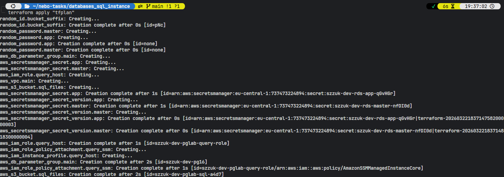
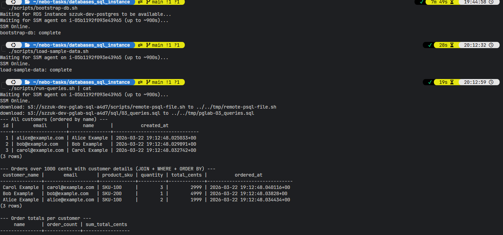
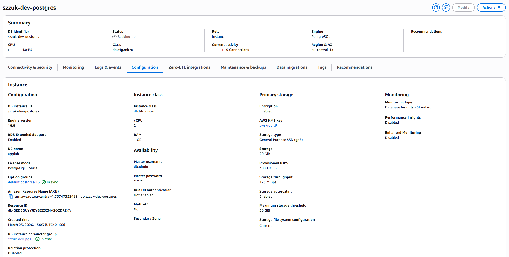
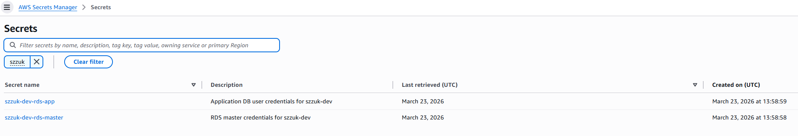
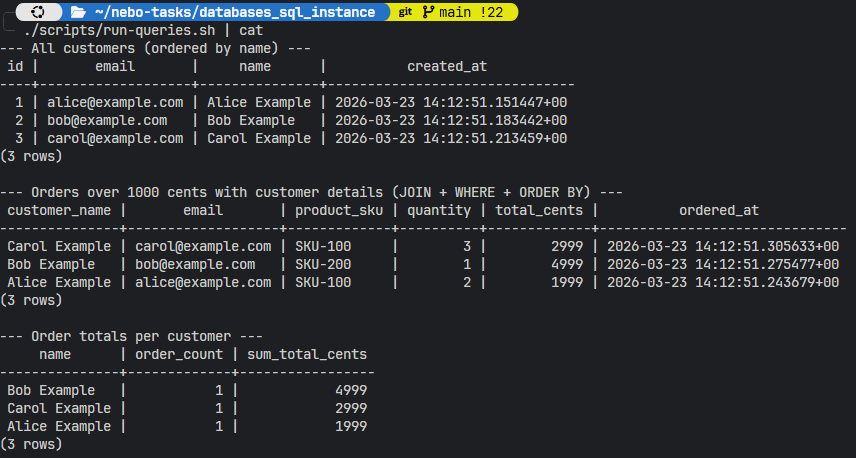
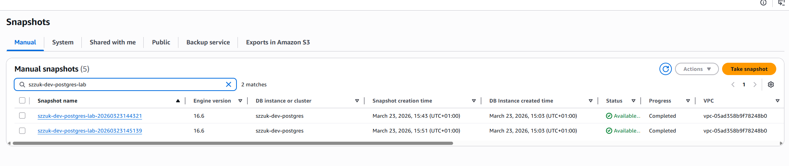

# PostgreSQL on Amazon RDS (simplified lab)

Terraform in **eu-central-1** / profile **softserve-lab** deploys **RDS PostgreSQL** in your account’s **default VPC**, **publicly reachable**, so you run **`psql`**, **`pg_dump`**, and the shell scripts **from your laptop**—no jump host, SSM, or S3.

RDS enforces **TLS** (`rds.force_ssl=1`). Passwords live in **Secrets Manager**.

## Prerequisites

- **Default VPC** with subnets in **at least two** availability zones (normal for AWS accounts).
- **Terraform** `>= 1.0`, **AWS CLI**, **jq**, **PostgreSQL client** (`psql`, `pg_dump`) matching your RDS **major** version (e.g. 16).

## Deploy

```bash
cd databases_sql_instance
terraform init
terraform plan
terraform apply
terraform output
```

## Scripts

Each script takes **no arguments**. It sets **`LAB_ROOT`**, runs **`terraform output -raw …`** and **`aws …`** inline (no shared library).

| Script | What it does |
|--------|----------------|
| [`scripts/bootstrap-db.sh`](scripts/bootstrap-db.sh) | RDS available → app role (SQL `EXCEPTION` if exists) → schema → grants |
| [`scripts/load-sample-data.sh`](scripts/load-sample-data.sh) | `sql/02_seed.sql` as app user |
| [`scripts/run-queries.sh`](scripts/run-queries.sh) | `sql/03_queries.sql` |
| [`scripts/backup.sh`](scripts/backup.sh) | RDS **snapshot** `…-lab-<timestamp>`, then **wait** until complete |
| [`scripts/backup-pgdump.sh`](scripts/backup-pgdump.sh) | Logical backup: **`pg_dump`** → `backups/` |
| [`scripts/validate-sql-lab.sh`](scripts/validate-sql-lab.sh) | Runs the four steps above in order |

**Order:** `bootstrap-db.sh` → `load-sample-data.sh` → `run-queries.sh` → `backup.sh`.

AWS CLI calls in the scripts use **`--profile softserve-lab`** and **`--region eu-central-1`** (edit the scripts if you use another profile/region). The Terraform provider uses the same profile and [`var.aws_region`](variables.tf).

**Hang / timeout on connect:** SG allows the Internet by default; if it still fails from **WSL2**, check **Windows Firewall** for outbound **5432**.

## Connection strings (no passwords)

Passwords: **Secrets Manager** (`master_secret_arn`, `app_secret_arn`).

```text
postgresql://app_rw:<PASSWORD>@<RDS_ENDPOINT>:5432/<DB_NAME>?sslmode=require
postgresql://dbadmin:<PASSWORD>@<RDS_ENDPOINT>:5432/<DB_NAME>?sslmode=require
```

Use `terraform output -raw rds_endpoint` and `terraform output -raw db_name`.

## Variables

See [`variables.tf`](variables.tf). **`rds_ingress_ipv4_cidr`** defaults to **`0.0.0.0/0`**. Automated backup retention, skip-final-snapshot on destroy, and Secrets Manager recovery window are fixed in **`main.tf`** `locals` for this lab.

## Proof of completion

### Terraform apply



### Database bootstrap



### RDS configuration



### Secrets Manager



### Queries (JOINs)



### RDS snapshots



