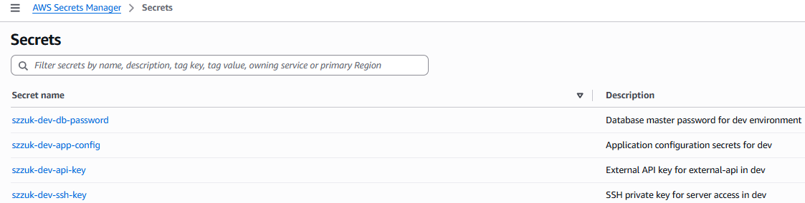
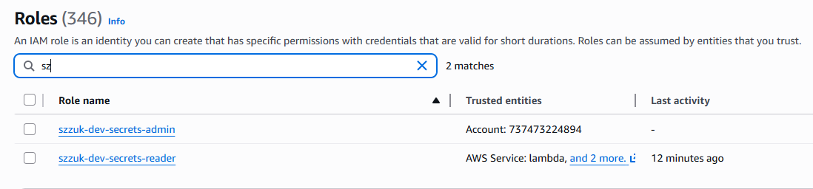
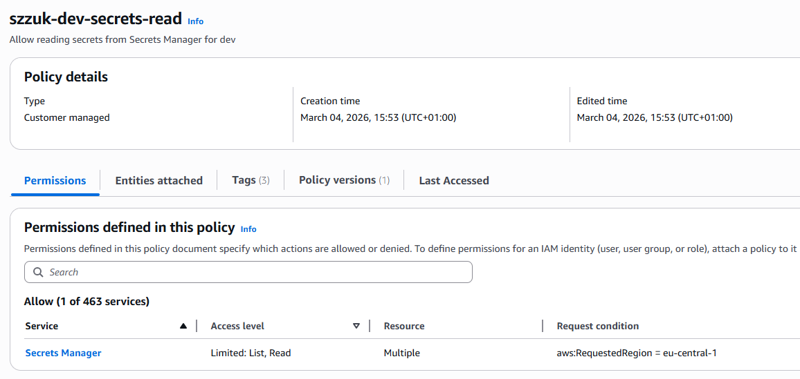
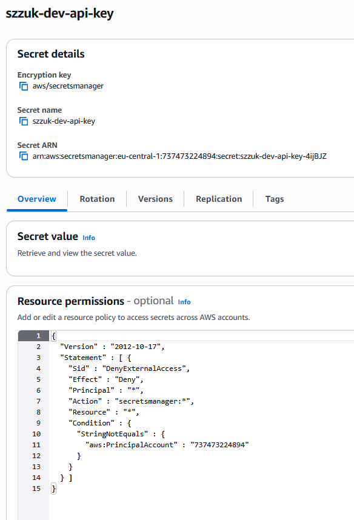
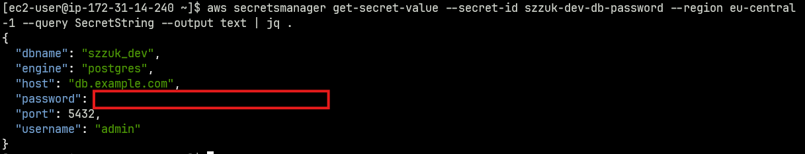

# IaaC Secret Management with AWS Secrets Manager

This project demonstrates secure secret management integration with Terraform and AWS Secrets Manager, following DevOps best practices for automated infrastructure provisioning.

## Quick Start

```bash
# Clone and navigate to project
cd iaac_secret_management

# Initialize Terraform
terraform init

# Review the plan
terraform plan

# Deploy infrastructure
terraform apply

# Get EC2 instance details
terraform output ec2_instance_id
terraform output ec2_public_ip

# Connect to EC2 and test secrets access
aws ec2-instance-connect ssh \
  --instance-id $(terraform output -raw ec2_instance_id) \
  --region eu-central-1 \
  --profile softserve-lab
```

## Architecture Overview

This project creates:

1. **4 Secrets** in AWS Secrets Manager:
   - Database credentials (db-password)
   - API key (api-key)
   - SSH private key (ssh-key)
   - Application configuration (app-config)

2. **2 IAM Roles** with distinct permissions:
   - `secrets-reader`: Read-only access for applications
   - `secrets-admin`: Full management access for DevOps

3. **1 EC2 Instance** demonstrating secret retrieval:
   - Amazon Linux 2023 (t3.micro)
   - Attached to `secrets-reader` role
   - Boot-time secret access verification

4. **Security Controls**:
   - Resource policies preventing cross-account access
   - Security groups restricting network access
   - CloudTrail logging for audit compliance

## Secrets Managed

### 1. Database Password (`db-password`)
- **Type**: Database credentials
- **Contains**: username, password, host, port, dbname, engine
- **Use case**: Application database connections

### 2. API Key (`api-key`)
- **Type**: External API credentials
- **Contains**: api_key, service name
- **Use case**: Third-party API authentication

### 3. SSH Private Key (`ssh-key`)
- **Type**: SSH authentication
- **Contains**: RSA private key (4096-bit), public key
- **Use case**: Server/instance access

### 4. Application Configuration (`app-config`)
- **Type**: Application secrets
- **Contains**: JWT secret, encryption key, session secret, OAuth config
- **Use case**: Application runtime configuration

## Retrieving Secrets

### Using AWS CLI

```bash
# Retrieve database password
aws secretsmanager get-secret-value \
  --secret-id szzuk-dev-db-password \
  --query SecretString \
  --output text \
  --profile softserve-lab \
  --region eu-central-1 | jq .

# Retrieve API key
aws secretsmanager get-secret-value \
  --secret-id szzuk-dev-api-key \
  --query SecretString \
  --output text \
  --profile softserve-lab \
  --region eu-central-1 | jq .
```

## Access Control Model

### Reader Role (`secrets-reader`)
- **Purpose**: Application runtime access to secrets
- **Permissions**: `GetSecretValue`, `DescribeSecret`, `ListSecrets`
- **Used by**: EC2 instances (extensible to ECS tasks, Lambda functions)
- **Principle**: Least privilege - read-only access

### Admin Role (`secrets-admin`)
- **Purpose**: Secret lifecycle management
- **Permissions**: Full `secretsmanager:*` actions
- **Used by**: DevOps engineers, automation pipelines
- **Principle**: Administrative access for management only

### Resource Policies
- **Cross-account protection**: Deny access from external AWS accounts
- **Encryption**: All secrets encrypted with AWS-managed keys (KMS)
- **Audit logging**: CloudTrail captures all secret access attempts

## Example Application: EC2 with Secrets Access

The project includes a working example (`example-application.tf`) that deploys an EC2 instance demonstrating secure secret retrieval.

### What's Deployed

- **EC2 Instance**: Amazon Linux 2023 (t3.micro, free tier eligible)
- **IAM Instance Profile**: Attached to `secrets-reader` role
- **Security Group**: Allows SSH access (port 22)
- **Pre-installed Tools**: AWS CLI, jq for JSON parsing

### Testing the Example

1. **Deploy the infrastructure:**
   ```bash
   cd iaac_secret_management
   terraform init
   terraform apply
   ```

2. **Connect to the EC2 instance:**
   ```bash
   aws ec2-instance-connect ssh \
     --instance-id $(terraform output -raw ec2_instance_id) \
     --region eu-central-1 \
     --profile softserve-lab
   ```

3. **Verify boot-time access check passed:**
   ```bash
   cat boot-status.txt
   ```

4. **Retrieve a secret using AWS CLI:**
   ```bash
   aws secretsmanager get-secret-value \
     --secret-id szzuk-dev-db-password \
     --region eu-central-1 \
     --query SecretString \
     --output text | jq .
   ```

```

## Secret Rotation

Secrets can be rotated at any time via the AWS CLI without modifying any Terraform code. Rotation generates a new value and stores it as a new secret version in Secrets Manager.

### Rotate a Secret

```bash
# Generate a new password and update the db-password secret
NEW_PASS=$(aws secretsmanager get-random-password \
  --password-length 32 \
  --require-each-included-type \
  --exclude-characters '"@/\\' \
  --query RandomPassword \
  --output text \
  --profile softserve-lab \
  --region eu-central-1)

# Retrieve current value, update the password field, and store the new version
CURRENT=$(aws secretsmanager get-secret-value \
  --secret-id szzuk-dev-db-password \
  --query SecretString \
  --output text \
  --profile softserve-lab \
  --region eu-central-1)

UPDATED=$(echo "$CURRENT" | jq --arg pw "$NEW_PASS" '.password = $pw')

aws secretsmanager put-secret-value \
  --secret-id szzuk-dev-db-password \
  --secret-string "$UPDATED" \
  --profile softserve-lab \
  --region eu-central-1
```

### Verify Rotation

```bash
# Check version history
aws secretsmanager describe-secret \
  --secret-id szzuk-dev-db-password \
  --query 'VersionIdsToStages' \
  --profile softserve-lab \
  --region eu-central-1

# Retrieve the updated value
aws secretsmanager get-secret-value \
  --secret-id szzuk-dev-db-password \
  --query SecretString \
  --output text \
  --profile softserve-lab \
  --region eu-central-1 | jq .
```

## Cleanup

To destroy all resources and avoid ongoing AWS costs:

```bash
terraform destroy

```

**Note**: Secrets have a 7-day recovery window by default. They will be scheduled for deletion but can be recovered during this period.

## Cost Estimate

- **Secrets Manager**: ~$0.40/secret/month × 4 = **~$1.60/month**
- **EC2 t3.micro**: ~$0.0104/hour = **~$7.49/month** (free tier eligible: 750 hours/month)
- **Data transfer**: Minimal (typically covered by free tier)

**Total estimated cost**: ~$9.09/month (or ~$1.60/month with free tier)

## Screenshots

### Secrets in AWS Secrets Manager



### IAM Roles



### IAM Policy (Reader)



### Resource Policies



### Secret Retrieval from EC2


