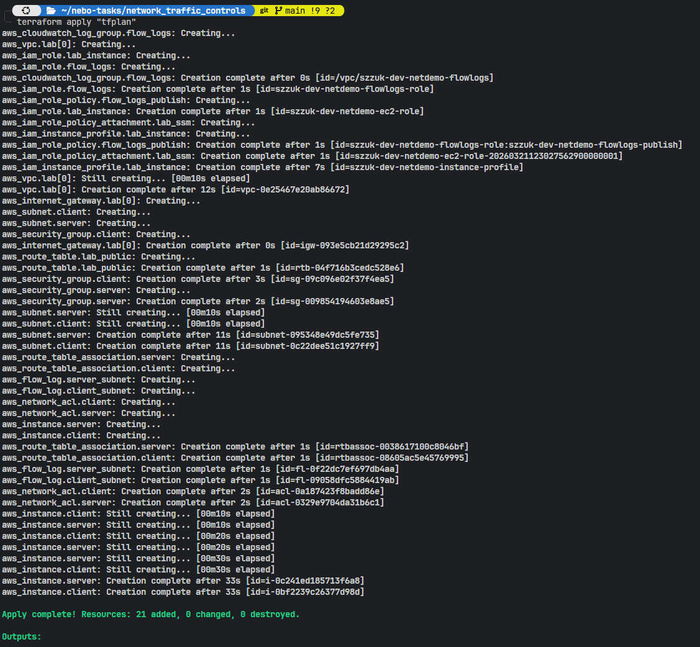
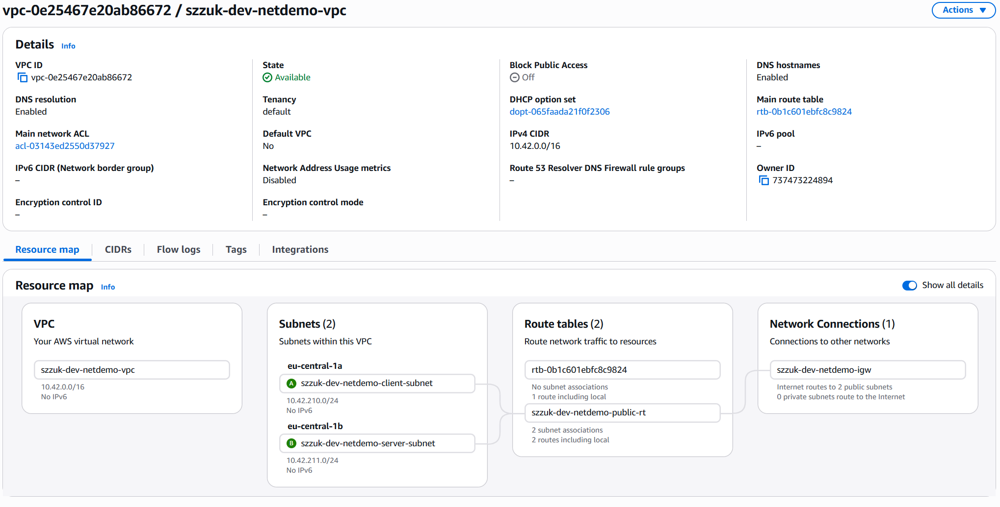
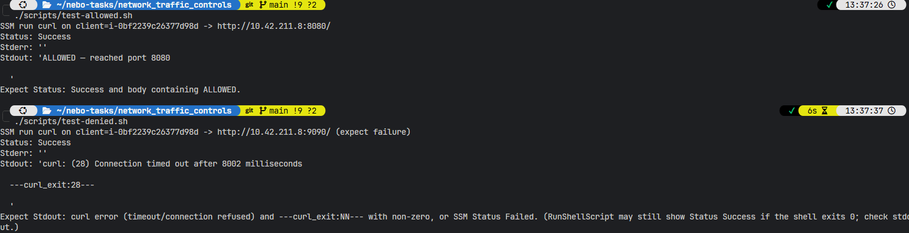
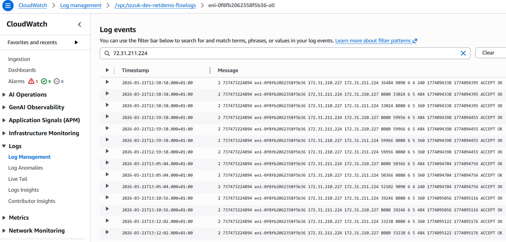

# Network traffic controls (AWS)

Terraform lab in **eu-central-1** (profile `softserve-lab`): **security groups** + **custom NACLs** on two public subnets, **VPC Flow Logs** to CloudWatch, and **SSM** scripts that curl between a client and server EC2 pair.

**Point of the demo:** **8080** is allowed by both SG and NACL. **9090** is allowed in the **server SG** from the client but **denied by the server subnet NACL**—so curl to 9090 fails even though the process is listening. Ports are configurable in [`variables.tf`](variables.tf).

By default Terraform creates a **new VPC** (`10.42.0.0/16`) and Internet Gateway so the VPC **Resource map** only shows this lab. Use `create_vpc = false` and set `vpc_id` to attach to an existing VPC instead.

## Deploy

```bash
cd network_traffic_controls
terraform init && terraform apply
```

Subnet CIDR clash inside the VPC: raise `lab_subnet_netnum_start` in [`variables.tf`](variables.tf). Optional SSH: `enable_ssh = true` and `trusted_admin_cidr = "YOUR_IP/32"` in `terraform.tfvars`.

## Validate

Wait until both instances are **Online** in SSM, then:

```bash
./scripts/test-allowed.sh
./scripts/test-denied.sh
./scripts/show-flow-samples.sh 30
```

`show-flow-samples.sh` uses GNU `date` (`-d`); use WSL/Linux or adjust the script on macOS.

## Proof of completion

Screenshots under [`static/`](static/).

**Terraform apply**



**VPC resource map**



**Connectivity tests** (8080 allowed, 9090 NACL-denied)



**Flow logs** (CloudWatch)



## Cleanup

```bash
terraform destroy
```

Terraform layout: `main.tf`, `vpc.tf`, `networking.tf`, `nacl.tf`, `security_groups.tf`, `iam.tf`, `compute.tf`, `flow_logs.tf`, `variables.tf`, `outputs.tf`; helpers under `scripts/`.
