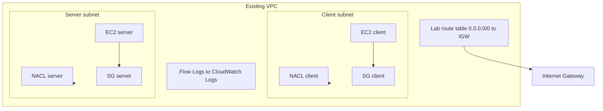

# Network traffic controls (AWS)

Terraform lab: **security groups** (stateful, instance ENI) plus **custom network ACEs** (stateless, subnet boundary), a **dedicated public route table** (Internet Gateway default route), **subnet-level VPC Flow Logs** to CloudWatch Logs, and scripted **SSM-based** connectivity tests. Terraform uses AWS profile `softserve-lab`, region `eu-central-1`, and resource names prefixed with `szzuk-`.

## Traffic control strategy

1. **Routing**: Lab subnets use a Terraform-managed route table with `0.0.0.0/0` → existing Internet Gateway. This is appropriate for a low-cost class environment; production workloads often use **private subnets** with **NAT Gateway** or **VPC endpoints** for tighter egress control.
2. **Security groups**: Restrict **ingress** on the server to demo ports from the **client security group only** (plus optional SSH from a **trusted CIDR**). **Egress** is limited to HTTPS (SSM/patches), DNS (UDP/53), and TCP to VPC for the demo ports on the client.
3. **Network ACLs**: Enforce **subnet-level** rules, including **ephemeral TCP ports** for return traffic and an **explicit deny** on one port that the security group would otherwise allow—proving that **NACLs can block traffic SG permits**.
4. **Observability**: Flow logs on **both** lab subnets ship to one CloudWatch Logs group (seven-day retention) to validate `ACCEPT` / `REJECT` style outcomes after tests.

### Stateful vs stateless NACL (short)

Security groups are **stateful**: if you allow an inbound TCP flow, return packets are implied. **NACLs are stateless**: you must allow **both** directions that your flows use. Return traffic from the internet typically hits **ephemeral destination ports** (`1024–65535`) on your instances.

## Architecture



## Rule catalog (purpose and justification)

Ports default to **8080** (allowed end-to-end) and **9090** (SG allows; NACL **denies**). Override with `demo_app_port_allow` / `demo_app_port_nacl_deny`.

| ID | Type | Direction | Ports / proto | Source or dest | Purpose | Justification |
|----|------|-----------|---------------|----------------|---------|---------------|
 RT-1 | Route | Outbound | `0.0.0.0/0` | IGW | Internet path | Required for public subnet + SSM over public IPs in this lab |
 SG-C1 | SG | Ingress | `tcp/22` | `trusted_admin_cidr` (optional) | Admin SSH | **Off by default**; enable only with `enable_ssh = true` and a narrow CIDR |
 SG-C2 | SG | Egress | `tcp/443` | `0.0.0.0/0` | HTTPS egress | SSM and package mirrors |
 SG-C3 | SG | Egress | `udp/53` | `0.0.0.0/0` | DNS | Name resolution |
 SG-C4 | SG | Egress | `tcp/demo ports` | VPC CIDR | Reach server from client | **Least privilege** vs `0.0.0.0/0` on app ports |
 SG-S1 | SG | Ingress | `tcp/22` | `trusted_admin_cidr` (optional) | Admin SSH | Same as SG-C1 |
 SG-S2 | SG | Ingress | `tcp/8080` | Client SG | Demo app | Only peer tier may call the workload |
 SG-S3 | SG | Ingress | `tcp/9090` | Client SG | Contrast port | **Intentionally allowed in SG** so NACL deny is observable |
 SG-S4 | SG | Egress | `tcp/443`, `udp/53` | `0.0.0.0/0` | Ops egress | SSM/DNS for server |
 NA-C1 | NACL | Ingress | `tcp/22` | Trusted CIDR | Optional SSH | Matches SG when `enable_ssh` |
 NA-C2 | NACL | Ingress | `tcp/1024-65535` | `0.0.0.0/0` | Ephemeral inbound | Return traffic for client-initiated sessions (e.g. SSM) |
 NA-C3 | NACL | Egress | `tcp/443` | `0.0.0.0/0` | HTTPS | Client egress alignment |
 NA-C4 | NACL | Egress | `tcp/demo ports` | VPC CIDR | To server | SYNs to demo ports |
 NA-C5 | NACL | Egress | `tcp/1024-65535` | `0.0.0.0/0` | Ephemeral outbound | Return legs for flows |
 NA-C6 | NACL | Egress | `udp/53` | `0.0.0.0/0` | DNS | Resolver queries |
 NA-S1 | NACL | Ingress | `tcp/22` | Trusted CIDR | Optional SSH | Matches SG when enabled |
 NA-S2 | NACL | Ingress | `tcp/8080` | VPC CIDR | Allowed demo | Subnet allow for permitted app |
 NA-S3 | NACL | Ingress | `tcp/9090` | `0.0.0.0/0` | **DENY** | Negative test | **Explicit deny** so SG-Allow + NACL-Deny is visible |
 NA-S4 | NACL | Ingress | `tcp/1024-65535` | `0.0.0.0/0` | Ephemeral inbound | Return traffic (e.g. SSM, responses to clients) — **evaluated after** deny for 9090 |
 NA-S5 | NACL | Egress | `tcp/1024-65535` | VPC CIDR | To client ephemerals | Responses to client |
 NA-S6 | NACL | Egress | `tcp/443`, `udp/53` | `0.0.0.0/0` | Ops | SSM / DNS |

**NACL evaluation order**: Lower `rule_no` wins first. The **9090 deny** uses a lower number than the wide ephemeral **allow** so deny still applies to that destination port.

## Before / after (conceptual)

| Aspect | Loose posture (avoid) | This lab |
|--------|------------------------|----------|
| App ingress source | `0.0.0.0/0` | Client **security group** only |
| SSH | `0.0.0.0/0` | **Disabled** by default; optional **single CIDR** |
| Client egress | All ports to Internet | **443 + DNS + VPC demo ports** |
| Subnet filter | Default NACL (allow all) | **Custom** NACL + explicit deny scenario |
| Telemetry | None | **Subnet flow logs** to CloudWatch |

## Deploy

```bash
cd network_traffic_controls
terraform init
terraform plan
terraform apply
```

Inputs: see [`variables.tf`](variables.tf). Override `vpc_id` or `lab_subnet_netnum_start` if `/24` subnets would collide (`cidrsubnet` uses indices `lab_subnet_netnum_start` and `lab_subnet_netnum_start + 1`).

Optional SSH (prefer Session Manager):

```hcl
enable_ssh          = true
trusted_admin_cidr  = "203.0.113.50/32"
```

## Validate connectivity

Wait until SSM reports both instances **Online** (agent ping).

```bash
# Allowed path (HTTP 8080)
./scripts/test-allowed.sh

# Denied path (HTTP 9090 — NACL blocks)
./scripts/test-denied.sh

# Recent flow log events
./scripts/show-flow-samples.sh 30
```

Record outputs in [`docs/TEST_RESULTS.md`](docs/TEST_RESULTS.md).

## Troubleshooting

| Symptom | Check |
|---------|--------|
| SSM **Connection lost** / offline | IAM `AmazonSSMManagedInstanceCore`, instance profile, public IP + NACL **443 egress** and **ephemeral ingress**, IGW route |
| **8080** works but **9090** also works | NACL association on server subnet, rule numbers, wrong VPC |
| **8080** fails | SG references client SG, server user data (`/var/log/...`), NACL allow 8080 from VPC CIDR |
| Flow log group empty | Deliver delay (few minutes); confirm subnet flow resources; run traffic tests |
| `terraform apply` subnet errors | CIDR overlap—raise `lab_subnet_netnum_start` |

## Governance (non-functional checklist)

- Changes only via **Terraform** / PR review; no ad-hoc console drift.
- **Owner** / **Project** / **ManagedBy** tags applied via provider `default_tags`.
- **Review** SG and NACL rules quarterly or when workloads change.
- **Cost**: EC2 hours, CloudWatch Logs ingestion/storage; run `terraform destroy` when finished to avoid ongoing charges.

## Cleanup

```bash
terraform destroy
```

## Files

| File | Role |
|------|------|
| [`main.tf`](main.tf) | Provider and Terraform block |
| [`variables.tf`](variables.tf) | Inputs and validations |
| [`outputs.tf`](outputs.tf) | IDs, IPs, log group, demo ports |
| [`networking.tf`](networking.tf) | Subnets, route table, IGW |
| [`nacl.tf`](nacl.tf) | Custom NACLs |
| [`security_groups.tf`](security_groups.tf) | Client and server SGs |
| [`iam.tf`](iam.tf) | SSM instance role; flow logs publisher role |
| [`compute.tf`](compute.tf) | Two Amazon Linux 2023 instances |
| [`flow_logs.tf`](flow_logs.tf) | CloudWatch Logs + per-subnet flow logs |
