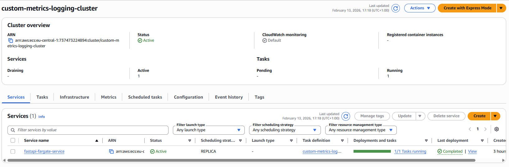
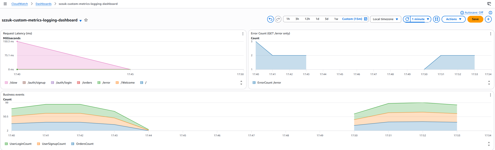
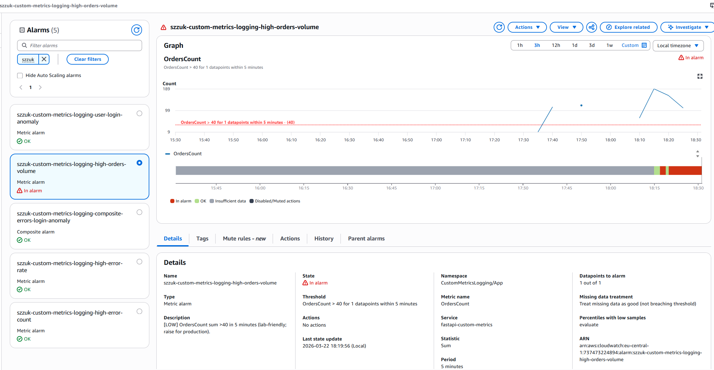

# Custom Metrics for Monitoring and Logging

FastAPI service on **AWS ECS Fargate** that publishes application metrics to **Amazon CloudWatch** with **`PutMetricData` (boto3)**. Infrastructure (VPC-related inputs, ECR, ECS, logs, dashboard, alarms, IAM task role) is defined in **Terraform**.

**Region / profile (lab):** `eu-central-1`, AWS CLI profile `softserve-lab`.

## Metrics (`CustomMetricsLogging/App`)

| Metric | Dimensions | When it is published |
| ------ | ---------- | -------------------- |
| **RequestLatencyMs** | `Service`, `Endpoint` | Every handled request (`fastapi-custom-metrics` + route path) |
| **ErrorCount** | `Service`, `Endpoint` | When HTTP status is **≥ 400** (e.g. `GET /error` → 500) |
| **OrdersCount** | `Service` only | Successful `POST /orders` |
| **UserLoginCount** | `Service` only | Successful `POST /auth/login` |
| **UserSignupCount** | `Service` only | Successful `POST /auth/signup` |

There is **no** EMF on stdout for these metrics; the app calls CloudWatch directly. **ECS task IAM role** must allow `cloudwatch:PutMetricData` for this namespace (see `ecs.tf`).

Container **stdout/stderr** still go to CloudWatch Logs group **`/ecs/custom-metrics-logging`** via the `awslogs` driver (operational logging, not metric extraction).

## Implementation

- **`fastapi-docker-optimized/server.py`**: `publish_metrics` / `publish_request_metrics`; each route records latency and optional **ErrorCount** / business counters, then returns the HTTP response.
- **Image build**: project **`Dockerfile`** at repo root; build context **`fastapi-docker-optimized/`** (see deployment commands below).
- **Dashboard** (`monitoring.tf`): **Request latency** by endpoint, **Error count** for `/error`, **Business events** (`OrdersCount`, `UserSignupCount`, `UserLoginCount`).
- **Alarms** (`monitoring.tf`): mix of **threshold**, **metric math**, **anomaly detection**, and **composite**:

  | Type | Alarm name (prefix `szzuk-custom-metrics-logging-`) | Severity | Purpose |
  | ---- | ----------------------------------------------------- | -------- | ------- |
  | Threshold | `high-error-count` | HIGH | Sum of **ErrorCount** ≥ 5 in 2 minutes (`Service` rollup) |
  | Anomaly | `user-login-anomaly` | MEDIUM | **UserLoginCount** outside CloudWatch anomaly band |
  | Threshold | `high-orders-volume` | LOW | **OrdersCount** sum > 40 in 5 minutes (lab threshold) |
  | Metric math | `high-error-rate` | HIGH | **(ErrorCount / RequestLatencyMs sample count) × 100** > 10% in one 60s period |
  | Composite | `composite-errors-login-anomaly` | HIGH | **high-error-count** AND **user-login-anomaly** in `ALARM` |

Tune thresholds in `monitoring.tf` for production. **Anomaly** and **composite** need baseline data (or lab overrides — see `scripts/test-alarms.sh`).

## Project structure

```
observability_custom_metrics_logging/
├── Dockerfile                    # Production image (build context: fastapi-docker-optimized/)
├── fastapi-docker-optimized/
│   ├── server.py                 # FastAPI app + CloudWatch metrics
│   ├── Dockerfile                # Optional local image
│   ├── docker-compose.yml
│   ├── pyproject.toml
│   └── ...
├── scripts/
│   ├── generate_traffic.sh       # Steady traffic for dashboards
│   └── test-alarms.sh            # Load patterns + optional FORCE_ANOMALY_ALARM for alarms
├── static/                       # Screenshots (see Results)
├── main.tf
├── variables.tf
├── networking.tf
├── ecr.tf
├── ecs.tf                        # Cluster, task definition (execution + task role), service
├── monitoring.tf                 # Dashboard + metric/composite alarms
└── outputs.tf
```

## Deployment

Prerequisites: **Terraform**, **Docker**, **AWS CLI** (`softserve-lab`, `eu-central-1`).

```bash
# 1. Provision infrastructure
cd observability_custom_metrics_logging
terraform init && terraform apply

# 2. Build and push image to ECR, then roll ECS

ECR_URI=$(aws ecr describe-repositories \
  --repository-names custom-metrics-logging \
  --profile softserve-lab \
  --region eu-central-1 \
  --query 'repositories[0].repositoryUri' \
  --output text)

aws ecr get-login-password --region eu-central-1 --profile softserve-lab | \
  docker login --username AWS --password-stdin "${ECR_URI%%/*}"

docker build -t "${ECR_URI}:latest" -f Dockerfile fastapi-docker-optimized

docker push "${ECR_URI}:latest"

aws ecs update-service \
  --cluster custom-metrics-logging-cluster \
  --service fastapi-fargate-service \
  --force-new-deployment \
  --profile softserve-lab \
  --region eu-central-1
```

If `terraform output -raw ecr_repository_url` works in your state, you can use that instead of `describe-repositories`.

## Testing

Use the task **public IP** or load balancer URL from ECS / EC2.

**General traffic** (dashboards):

```bash
./scripts/generate_traffic.sh http://<public-ip>
```

**Alarms** (thresholds, error rate, orders; optional composite helper):

```bash
./scripts/test-alarms.sh http://<public-ip>
FORCE_ANOMALY_ALARM=1 ./scripts/test-alarms.sh http://<public-ip>   # lab: set login anomaly to ALARM
```

Default CLI context: `AWS_PROFILE` / `AWS_REGION`, else `softserve-lab` / `eu-central-1`.

**Why only one alarm may show at first:** `high-error-count` is usually fastest. `high-orders-volume` waits on a **5-minute** metric period. `high-error-rate` needs a full **60s** evaluation window. Re-check after **10–15 minutes**, or read the notes printed by `test-alarms.sh`.

**Verify**

1. **Logs**: CloudWatch Logs → `/ecs/custom-metrics-logging`.
2. **Metrics**: CloudWatch → Metrics → `CustomMetricsLogging/App`.
3. **Dashboard**: `szzuk-custom-metrics-logging-dashboard`.
4. **Alarms**:

```bash
aws cloudwatch describe-alarms \
  --alarm-name-prefix "szzuk-custom-metrics-logging" \
  --profile softserve-lab \
  --region eu-central-1 \
  --query 'MetricAlarms[*].[AlarmName,StateValue]' \
  --output table

aws cloudwatch describe-composite-alarms \
  --alarm-name-prefix "szzuk-custom-metrics-logging" \
  --profile softserve-lab \
  --region eu-central-1
```

## Results

Screenshots in [`static/`](static/):

### ECS (Fargate service)



### CloudWatch dashboard (custom metrics)



### CloudWatch alarms



## Cleanup

```bash
terraform destroy
```
